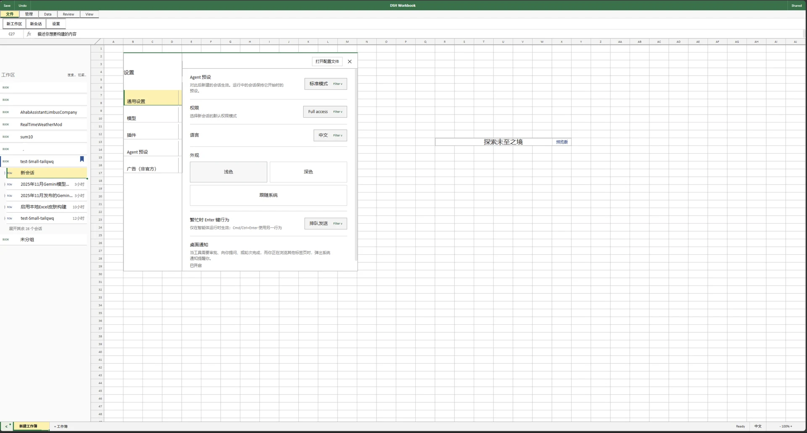
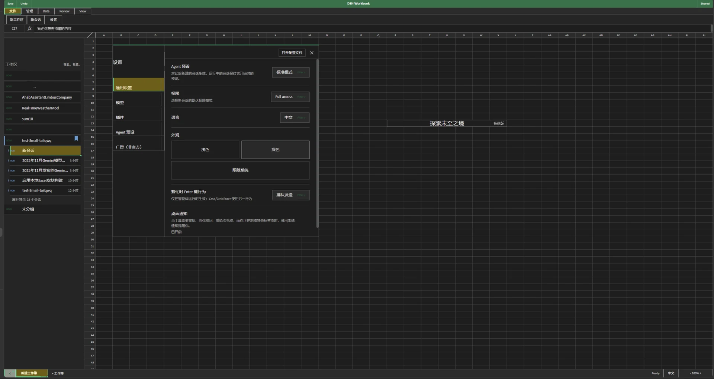

# Deepcel Workbook

[简体中文](README.md) | English

An Excel-inspired skin for the DSH Web GUI. Deepcel does more than swap colors:
it reorganizes the existing UI entry points into a spreadsheet — the ribbon
manages files, sessions and run options; messages, tools, trajectory and the
composer fall into one uniform cell grid; workbook tabs carry multi-session
switching.

Target host: DSH `0.1.2-rc.1`. The formula bar keeps the native Lexical editor,
attachments and commands; targets, queued messages, turn navigation and usage
popups adopt worksheet styling.

## Features

- Full row numbers, column labels, background grid, active-cell and workbook
  status bar
- Conversation prose mapped to merged cells by semantic block; user messages
  use a review-comment style
- Input edited in the formula bar, expanding with multiple lines
- Workspaces and sessions arranged in a workbook outline hierarchy; expanding
  the sidebar moves the whole sheet together
- Bash, Pwsh, produced-file rows, message actions and the trajectory table use
  worksheet-record layouts
- Permission, model, thinking, agent-preset and workspace selection reuse the
  native behavior entry points
- Long-session scrolling keeps row numbers, the background grid and the
  selection in sync; switching sessions clears the selection

## Preview

| Light | Dark |
|---|---|
| [](preview/light.webp) | [](preview/dark.webp) |

## Install

A working DSH Web instance is required. Installing the skin manager along with
the skin is recommended — it switches skins and adjusts this skin's options:

```powershell
dsh plugin --profile web add 'github:Small-tailqwq/dsh-deep-whale#path:/skin-manager'
dsh plugin --profile web add 'github:Small-tailqwq/dsh-deepcel#path:/deepcel'
```

`#path:` selects a subdirectory; in PowerShell `#` starts a comment, so the
spec must be wrapped in single quotes (replace `web` with your profile name).
Restart DSH Web after the first install, then pick Deepcel in
**Settings → Skin manager**; later switches use config hot-reload. The package
name is `@dsh-external/dsh-client-ui-skin-deepcel`, wiring id `ui-skin-deepcel`.

## Development & Build

This directory is a single skin package inside the scaffold workspace, with
the same layout as the template `skins/template-skin/`. Source lives in `src/`,
DOM/CSS behavior regressions in `tests/`, prebuilt artifacts in `lib/`.

From the scaffold root:

```powershell
pnpm install
pnpm art:embed deepcel
pnpm --filter ./skins/deepcel build
pnpm --filter ./skins/deepcel typecheck
pnpm --filter ./skins/deepcel test
node scripts/verify-skin.mjs deepcel
node scripts/audit-bundle.mjs deepcel
```

Deepcel currently embeds no extra artwork; `assets/art.manifest.json` stays an
empty manifest so the scaffold's generation and inspection entry points keep
working.

## License & Trademarks

BSD-3-Clause; see `LICENSE`.

Deepcel is an independent community project with no affiliation with,
sponsorship by, or endorsement from Microsoft. Microsoft Excel is a trademark
of the Microsoft group of companies. This project's name, package name, DOM
scope and public metadata all use Deepcel and do not include Microsoft code,
icons, brand assets or product resources. See `NOTICE.md` for details.
